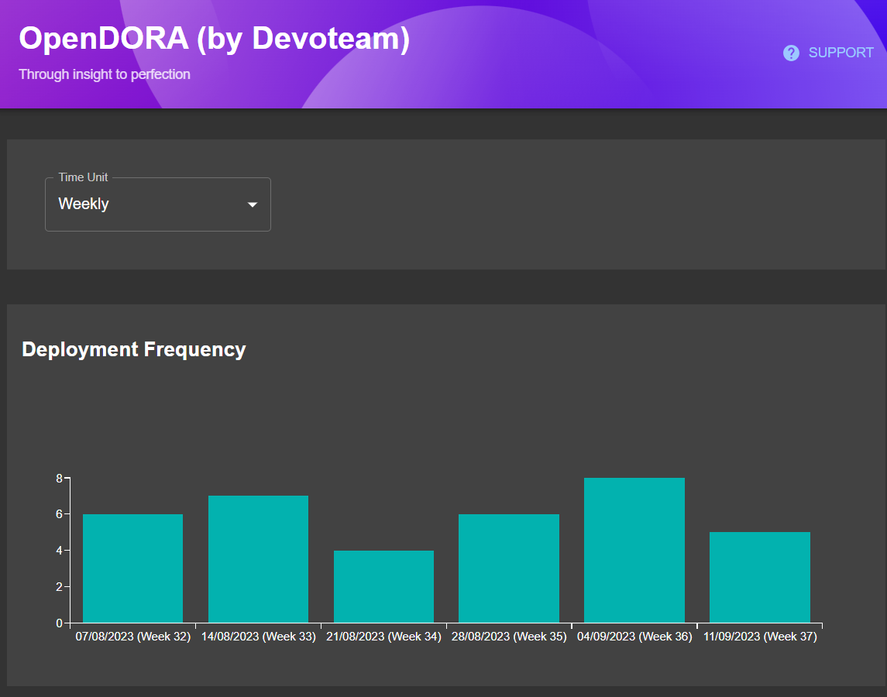

# OpenDORA (by Devoteam)

Bring [DORA](https://dora.dev/) metrics to your Backstage dashboard using [DevLake](https://devlake.apache.org/docs/DORA/) to gather data.

This repo contains all the projects needed to start development on the OpenDORA backstage plugin for DORA metrics.

## Setup

Take a look at the [NPM library](backstage-plugin/plugins/open-dora/README.md) for steps on how to install and setup the plugin in your Backstage application.

## Development contents

### backstage-plugin

This is a [Backstage](https://backstage.io) plugin setup used to develop the frontend plugin.

[More details](backstage-plugin/README.md)

### devlake-go

This contains the docker image and configuration scripts to setup DevLake to properly ingest the DORA metrics from a GitLab repo and group them according to Backstage groups.

[More details](devlake-go/README.md)

### dora-api-mock

This is a basic Spring application used to provide a mock for the DORA API metric datapoints. This can be used to develop the frontend plugin without needing to setup the local backend API.

[More details](dora-api-mock/README.md)

### dev-environment

Contains an initial docker compose with the services needed to test the metrics in the dev's local environment.

[More details](dev-environment/README.md)
